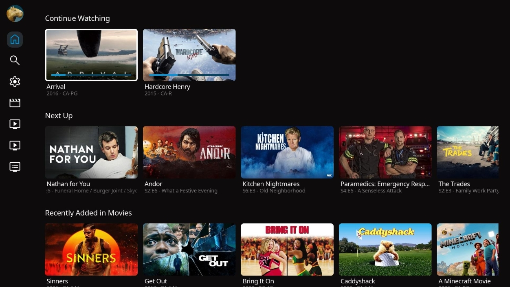
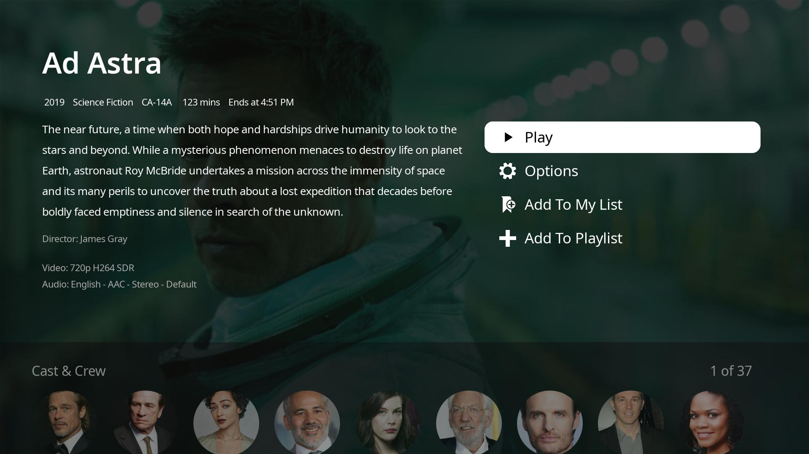
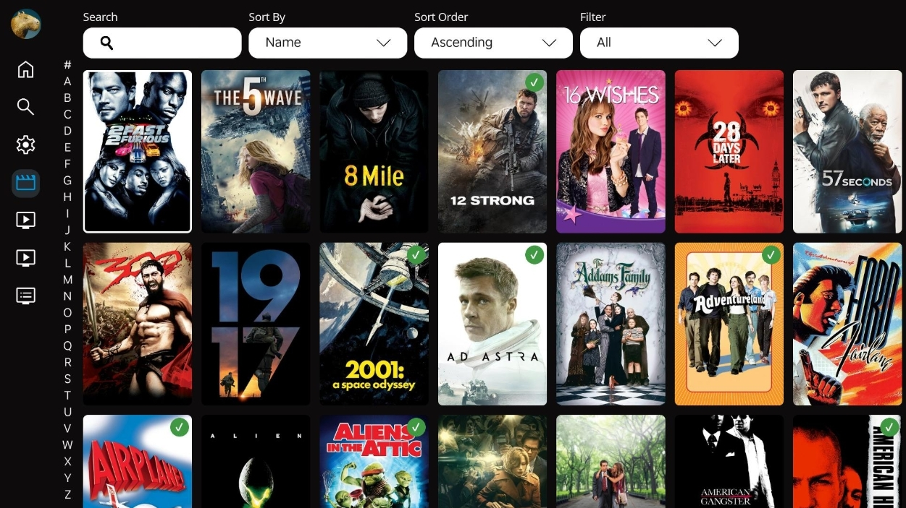

  

<h1 align="center">Fin for Roku</h1>

<em>An Unofficial Jellyfin Client for Roku</em>

---

## About

**Fin for Roku** is a fork of the [official Jellyfin Roku client](https://github.com/jellyfin/jellyfin-roku), redesigned with a custom interface and user experience.  
It is **not affiliated with the Jellyfin project**.

## Screenshots
Screenshots below may be outdated. Last screenshots taken: `2025-06-12`

<table align="center">
  <tr>
    <td align="center">
       
      Homepage
    </td>
    <td align="center">
       
      Movie Details
    </td>
  </tr>
  <tr>
    <td align="center">
       
      Movie Library
    </td>
    <td align="center">
       
      Server Select
    </td>
  </tr>
</table>

## License

This project is licensed under the terms of the [GNU GPL v2.0](LICENSE).  
It is a derivative work based on [Jellyfin Roku](https://github.com/jellyfin/jellyfin-roku), and follows the same license.
